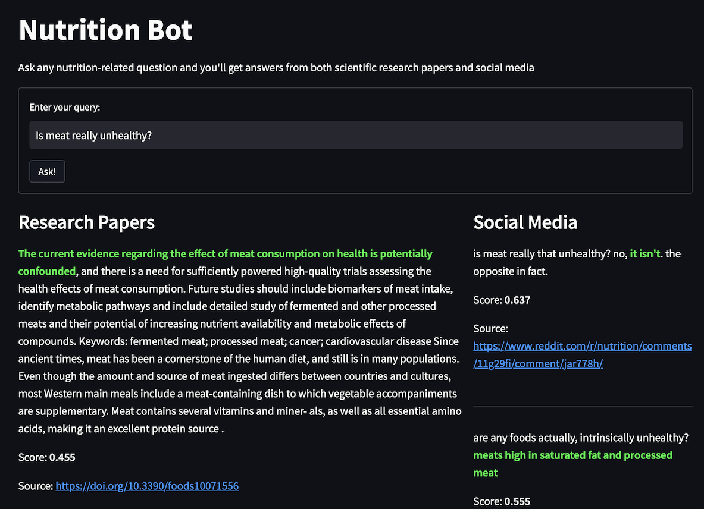

# Nutrition Bot

**Duke AIPI 540 Natural Language Processing Module Project by Yilun Wu, Shen Juin Lee, Shrey Gupta**

## Question-Answer interface for nutrition (Streamlit App):
A streamlit-based web application which allows you to ask any nutrition-related question and get answers from both scientific research papers and social media. Scores shown represent the relevancy of each answer to the query.
>

## Running the Code

**1. Clone the repository**
```bash
git clone https://github.com/textomatic/nutrition-bot.git
```

**2. Switch to the `st` branch**
```bash
git checkout st
```

**3. Create a conda environment and activate it:** 
```bash
conda create --name nutritionbot_streamlit python=3.8
conda activate nutritionbot_streamlit
```

**4. Install requirements:** 
```bash
pip install -r requirements.txt
```

**5. Run the application**
```bash
streamlit run app/home.py
```